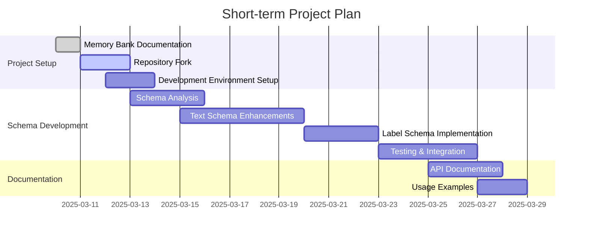

# PDFme Extensions Active Context

## Current Focus
We are in the initial setup phase of the PDFme Extensions project. The primary focus is to:
1. Fork the complete @pdfme/schemas repository, maintaining the playground for testing
2. Set up the development environment following the original repo's structure
3. Focus on expanding text schema capabilities with enhanced formatting options
4. Prepare for selective publishing of the enhanced schemas package as PARS-DOE/pdfme-extensions

## Recent Work
- Created memory bank documentation to capture project knowledge
- Defined the project scope and goals
- Researched PDFme's plugin architecture and schema implementation patterns
- Identified specific schema enhancements to prioritize based on current limitations
- Developed a detailed implementation plan

## Next Steps

### Immediate Tasks
1. **Fork the Complete @pdfme Repository**:
   - Create a full fork of the repository
   - Set up the development environment following the original workflow
   - Familiarize ourselves with the existing code structure

2. **Project Setup**:
   - Follow original repository's build and test structure
   - Set up the playground for testing schema enhancements
   - Ensure all existing tests pass with the current implementation

3. **Schema Analysis**:
   - Review existing schemas with particular focus on text implementation
   - Identify extension points for enhanced formatting
   - Create a plan for implementing prioritized enhancements

4. **Initial Schema Implementation**:
   - Enhance text schema with additional capabilities
   - Implement dedicated readonly label schema
   - Add support for borders and conditional formatting

## Active Decisions and Considerations

### Publication Strategy
- Will publish as PARS-DOE/pdfme-extensions (not @pdfme/extensions) since we're not the original package owners
- Will maintain a modular approach mirroring the original pdfme repo
- Will need to handle upstream changes, hoping they won't make breaking changes to the schema API

### Schema Prioritization
Based on the identified limitations, we will prioritize implementing:
1. **Enhanced Text Schema**:
   - Add conditional formatting based on field values
   - Improve numerical value formatting (currency, percentages)
   - Add border options for text elements

2. **Dedicated Label Schema**:
   - Readonly by default (vs text schema where readonly is a toggle)
   - More formatting options
   - Optimized for display purposes

3. **Table Display Schema**:
   - Non-dynamic tables for display purposes
   - True table structures with aligned cells and borders
   - Simplified layout for static content

4. **Conditional Elements**:
   - Schema elements with conditional visibility
   - Support for showing/hiding based on data values

### Technical Approach
- Maintain full repository structure including playground for testing
- Selectively publish enhanced schemas package as npm package
- Follow original repository's development workflow and tooling

### Integration Strategy
- Maintain compatibility with PDFme's plugin architecture
- Extend rather than replace existing schemas
- Ensure backward compatibility with existing templates

## Current Questions
- How to best structure the enhanced schemas to maintain compatibility?
- What are the limitations of the current PDF rendering approach that might impact our enhancements?
- How can we implement conditional formatting within the constraints of the PDF generation process?
- What approach should we take for implementing true table structures?