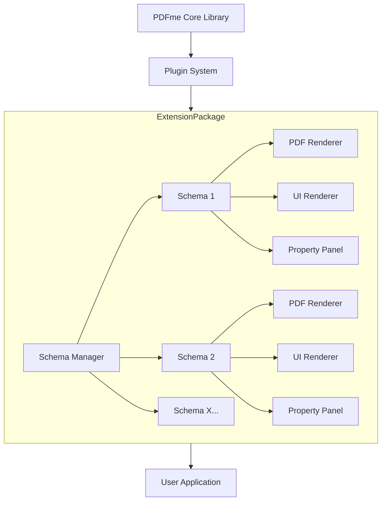
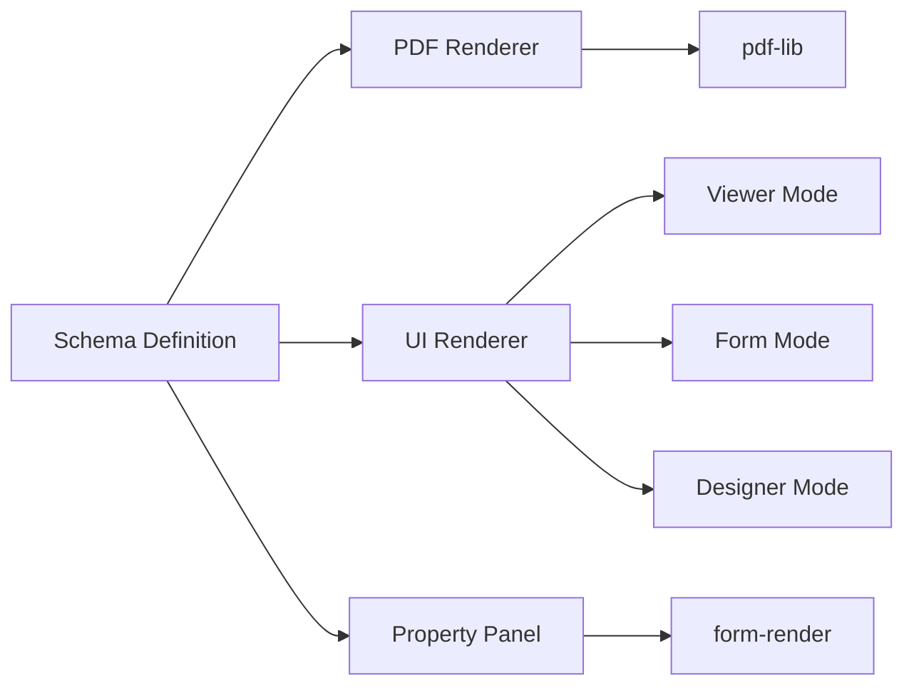
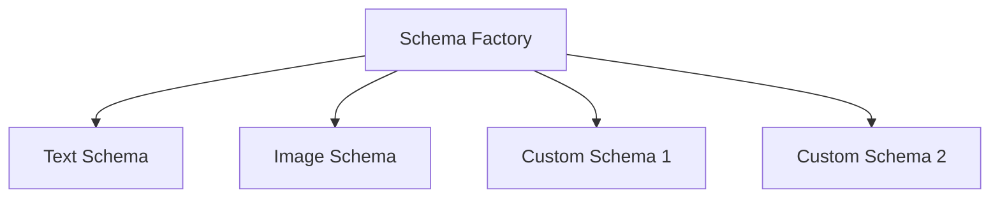
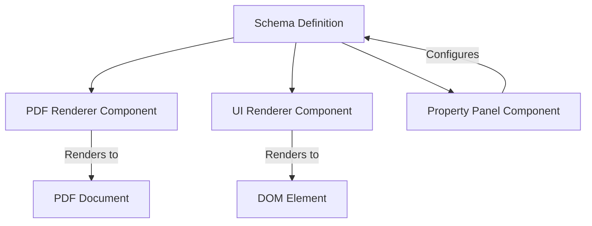
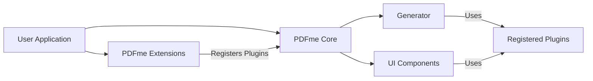

# PDFme Extensions System Patterns

## System Architecture



## Plugin Structure
Each schema in the PDFme Extensions package follows the plugin structure defined by PDFme:

1. **PDF Renderer**: Responsible for rendering the schema into a PDF document using pdf-lib
2. **UI Renderer**: Renders the schema in the DOM with different modes:
   - **Viewer Mode**: Preview that matches the PDF rendering
   - **Form Mode**: Interactive form for user input
   - **Designer Mode**: WYSIWYG editor for schema configuration
3. **Property Panel**: Configurable property editor that appears in the Designer sidebar



## Design Patterns

### Factory Pattern
Schemas are created using a factory pattern, allowing for consistent instantiation and configuration.



### Plugin Pattern
The entire system is built around a plugin architecture, allowing users to selectively include only the schemas they need.

### Caching Pattern
Performance-critical operations like rendering barcodes or processing images implement caching to optimize repeated operations.

## Component Relationships

### Schema Components
Each schema consists of three main components that work together:



### Integration with PDFme
The PDFme Extensions package integrates with PDFme through its plugin system:



## Technical Implementation

### Schema Registration
Schemas are registered with PDFme's plugin system by providing the appropriate renderers and property panels:

```javascript
// Example registration
import { text } from '@pdfme/schemas';
import { signature, rating } from '@pdfme/extensions';

// Register with Generator
const pdf = await generate({
  template,
  inputs,
  plugins: {
    text,
    signature,
    rating
  },
});

// Register with UI components
const designer = new Designer({
  domContainer,
  template,
  plugins: {
    text,
    signature,
    rating
  },
});
```

### Extensibility
The architecture is designed to be extensible, allowing for future schemas to be added without modifying existing code.